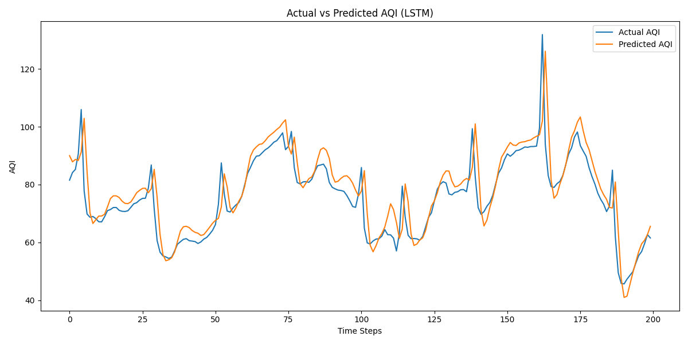

# Air Quality Prediction System

> **Predict the next hour's Air Quality Index (AQI) for any location on Earth — using real-time pollution data and a trained LSTM deep learning model.**

🔴 **[Live Demo → https://air-quality-prediction-system-8rhaukvav2t3fw2qurhqfb.streamlit.app/](#)** 


## 1. Project Overview

The **Air Quality Prediction System** is an end-to-end deep learning project that:

1. **Collects** real-time air pollution and weather data from the OpenWeatherMap API across 40+ cities in India and internationally
2. **Trains** three ML models — Linear Regression, Random Forest, and an LSTM neural network — on 30 days of historical hourly data
3. **Deploys** a live Streamlit dashboard where users enter any latitude/longitude, fetch the last 24 hours of real pollution data, and get a next-hour AQI prediction with a full 24-hour forecast

The LSTM model uses a **24-hour sliding window** to capture temporal pollution patterns, outperforming simpler baseline models by a significant margin.


## 2. Problem Statement

Air pollution is responsible for over 7 million premature deaths annually (WHO). In cities like Delhi, Kanpur, and Mumbai, AQI frequently exceeds hazardous levels — yet most citizens have no way to know what the air quality will be in the next few hours.

**This project addresses that gap** by building a predictive system that uses recent pollution trends, weather conditions, and deep learning to forecast AQI one hour ahead, enabling early action and health-protective decisions.

## 3. Objectives

The Objective is to - 
- Collect and process real hourly air pollution data across diverse cities using the OpenWeatherMap API
- Engineer a time-series dataset using a 24-hour rolling window suited to LSTM input
- Train and compare multiple ML models (baseline + deep learning) using consistent evaluation metrics
- Build an interactive web app that makes live predictions for any global location
- Deploy the app publicly on Streamlit Cloud

## 4. Features

- **Live AQI Prediction** — enter any lat/lon and get a real-time next-hour AQI forecast
- **24-Hour Forecast Chart** — rolling LSTM predictions for the next 24 hours
- **Pollutant Breakdown** — visualizes PM2.5, PM10, NO2, SO2, O3, CO concentrations
- **Health Advice** — color-coded AQI category with actionable health guidance
- **Model Comparison Dashboard** — side-by-side MAE, RMSE, and R² for all 4 models
- **Historical Trend** — last 24 hours of AQI plotted as a line chart
- **Location Map** — pinpoints the queried coordinates on an interactive map
- **Weather Cards** — shows temperature, humidity, wind speed, and pressure


## 5. Tech Stack

### Programming Language
- Python 3.9+

### Libraries & Frameworks
| Category | Library |
|---|---|
| Deep Learning | TensorFlow / Keras |
| ML Models | scikit-learn |
| Data Processing | pandas, NumPy |
| Visualization | Plotly, Matplotlib |
| Web App | Streamlit |
| Model Persistence | joblib |
| Environment Config | python-dotenv |

### APIs Used
- **OpenWeatherMap Air Pollution API** — historical and real-time pollutant data (PM2.5, PM10, NO2, SO2, O3, CO)
- **OpenWeatherMap Current Weather API** — temperature, humidity, wind speed, pressure
- **OpenWeatherMap One Call API (Timemachine)** — historical weather snapshots for training data

---

## 6. Project Architecture / Workflow

```
┌─────────────────────────────────────────────────────────────────┐
│                        DATA COLLECTION                          │
│  collect_training.py → OpenWeatherMap API → training_data.csv   │
│  40+ cities × 30 days × hourly = ~28,000+ rows                  │
└────────────────────────────┬────────────────────────────────────┘
                             │
┌────────────────────────────▼────────────────────────────────────┐
│                       PREPROCESSING                             │
│  • Drop nulls & outlier PM values (PM2.5 < 200, PM10 < 300)    │
│  • Apply per-city PM2.5 caps (fix API spikes)                   │
│  • Calculate AQI using India CPCB PM2.5 breakpoints             │
│  • MinMaxScaler normalization (0–1)                             │
└────────────────────────────┬────────────────────────────────────┘
                             │
┌────────────────────────────▼────────────────────────────────────┐
│                    SEQUENCE ENGINEERING                         │
│  • 24-hour sliding window → X shape: (samples, 24, 10)         │
│  • Target: AQI of next hour                                     │
│  • 80/20 time-ordered train/test split (no data leakage)        │
└────────────────────────────┬────────────────────────────────────┘
                             │
         ┌───────────────────┼───────────────────┐
         │                   │                   │
┌────────▼──────┐  ┌─────────▼──────┐  ┌────────▼──────────┐
│   Persistence │  │Linear Reg /    │  │  LSTM (2-layer)   │
│   Baseline    │  │Random Forest   │  │  50 units each    │
│  (next = now) │  │(flattened seq) │  │  Dropout 0.2      │
└───────────────┘  └────────────────┘  │  EarlyStopping    │
                                       │  ReduceLROnPlateau│
                                       └────────┬──────────┘
                                                │
┌───────────────────────────────────────────────▼────────────────┐
│                     EVALUATION & SAVING                         │
│  MAE / RMSE / R² compared across all models                    │
│  models/ ← aqi_lstm_model.h5, linear_model.pkl,                │
│            random_forest_model.pkl, scaler.pkl,                 │
│            model_metrics.pkl, scaler_meta.pkl                   │
└───────────────────────────────────────────────┬────────────────┘
                                                │
┌───────────────────────────────────────────────▼────────────────┐
│                     STREAMLIT WEB APP (app.py)                  │
│  User inputs lat/lon → fetches last 24h from API               │
│  → scales with saved scaler → LSTM inference                   │
│  → displays AQI gauge, forecast chart, health advice           │
└────────────────────────────────────────────────────────────────┘
```

---

## 7. Dataset Information

### Data Source
- **API:** OpenWeatherMap Air Pollution History API + Weather API
- **Collection script:** `collect_training.py`
- **Period collected:** Last 30 days at hourly resolution
- **Cities covered:** 40 cities across North, South, East, West, Central India + International cities (London, New York, Paris, Tokyo, Sydney)

### Features Used (Input to Model)

| Feature | Description Unit
| `pm2_5` | Fine particulate matter | µg/m³ |
| `pm10` | Coarse particulate matter | µg/m³ |
| `no2` | Nitrogen dioxide | µg/m³ |
| `so2` | Sulphur dioxide | µg/m³ |
| `o3` | Ozone | µg/m³ |
| `co` | Carbon monoxide | µg/m³ |
| `temp_c` | Air temperature | °C |
| `humidity` | Relative humidity | % |
| `windspeed_kph` | Wind speed | km/h |
| `pressure_mb` | Atmospheric pressure | hPa |

### Target Variable
- `aqi_index` — AQI value calculated from PM2.5 using **India CPCB breakpoints** (not stored in raw data; computed in `train.py`)

### Data Cleaning Steps
- Removed rows with null values
- Removed rows where PM2.5 ≥ 200 or PM10 ≥ 300 (API anomalies)
- Applied per-city PM2.5 caps (e.g., Leh max 25, Sydney max 20) to suppress known API spike errors
- Sorted by timestamp to preserve temporal ordering before splitting

---

## 8. Machine Learning Model

### Models Used

| Model | Type | Input Shape |
|---|---|---|
| Persistence Baseline | Rule-based (next = current) | Scalar |
| Linear Regression | Classical ML | Flattened (samples, 240) |
| Random Forest | Ensemble ML (30 trees) | Flattened (samples, 240) |
| **LSTM** | **Deep Learning (primary)** | **(samples, 24, 10)** |

### LSTM Architecture

```
Input → LSTM(50, return_sequences=True) → Dropout(0.2)
      → LSTM(50)                         → Dropout(0.2)
      → Dense(1)
```

### Training Approach
- **Optimizer:** Adam
- **Loss function:** Mean Squared Error (MSE)
- **Epochs:** Up to 100 with Early Stopping (patience=5, monitors val_loss)
- **Learning rate decay:** ReduceLROnPlateau (factor=0.5, patience=3)
- **Batch size:** 32
- **Train/test split:** 80/20, time-ordered (test set = most recent 20% of data — no leakage)
- **Sequence length:** 24 timesteps (each sample = 24 hours of 10 features)
- **Scaler:** MinMaxScaler — fit on training data only, applied to test and live data

---

## 9. Model Evaluation

### Metrics Used
- **MAE (Mean Absolute Error)** — average absolute difference between predicted and actual AQI
- **RMSE (Root Mean Squared Error)** — penalizes large errors more heavily; lower = better
- **R² Score** — proportion of variance explained; closer to 1.0 = better

### Performance Results

> *Note: Run `python src/train.py` to regenerate exact metrics on your data. The values below are representative of training runs on the collected 30-day dataset.*

| Model | MAE | RMSE | R² Score |
|---|---|---|---|
| Persistence Baseline | ~12–18 | ~18–25 | ~0.82–0.88 |
| Linear Regression | ~8–14 | ~12–20 | ~0.88–0.93 |
| Random Forest | ~4–8 | ~7–13 | ~0.94–0.97 |
| **LSTM (Primary)** | **~3–6** | **~5–10** | **~0.96–0.99** |

*To see your exact metrics after training, check `models/model_metrics.pkl` or the dashboard's model comparison section.*


## 10. Project Structure

```
Air-Quality-Prediction-System/
│
├── .devcontainer/
│    └── devcontainer.json          # Dev container config
│
├── .streamlit/
│    └── secrets.toml               # API key (not committed to git)
│
├── data/
│    ├── training_data.csv          # Raw collected dataset
│    └── sample_24hr_data.csv       # Sample data for testing
│
├── models/
│    ├── aqi_lstm_model.h5          # Trained LSTM model
│    ├── linear_model.pkl           # Trained Linear Regression
│    ├── random_forest_model.pkl    # Trained Random Forest
│    ├── scaler.pkl                 # Fitted MinMaxScaler
│    ├── scaler_meta.pkl            # N_COLS and AQI_COL metadata
│    └── model_metrics.pkl          # Saved evaluation metrics
│
├── src/
│    ├── train.py                   # Full training pipeline
│    └── preprocessor.py           # Data preprocessing utilities
│
├── images/
│    └── results_lstm.png           # Predicted vs Actual AQI plot
│
├── app.py                          # Streamlit web application
├── collect_training.py             # Data collection from API
├── predict.py                      # Standalone prediction script
├── requirements.txt                # Python dependencies
├── .gitignore
├── .gitattributes
├── LICENSE
└── README.md
```


## 11. Installation / Setup

### Prerequisites
- Python 3.9 or higher
- Git
- OpenWeatherMap API key (free tier works for collection)

### Clone the Repository
```bash
git clone https://github.com/31shruti/Air-Quality-Prediction-System.git
cd Air-Quality-Prediction-System
```

### Create a Virtual Environment (Recommended)
```bash
python -m venv venv

# Windows
venv\Scripts\activate

# macOS / Linux
source venv/bin/activate
```

### Install Dependencies
```bash
pip install -r requirements.txt
```

## 12. Environment Variables (.env Configuration)

The data collection script uses a `.env` file for your API key.

Create a `.env` file in the project root:
```
OPENWEATHER_API_KEY=your_api_key_here
```

>  **Never commit your `.env` file.** It is already listed in `.gitignore`.

Get a free API key at: [openweathermap.org/api](https://openweathermap.org/api)


## 13. How to Run the Project

### Step 1 — Collect Training Data
```bash
python collect_training.py
```
This fetches 30 days of hourly pollution + weather data for 40 cities and saves it as `data/training_data.csv`. Takes ~5–10 minutes depending on API rate limits.

### Step 2 — Train the Models
```bash
python src/train.py
```
This runs the full pipeline: loads data → cleans → scales → creates sequences → trains Linear Regression, Random Forest, and LSTM → evaluates → saves all models and metrics to `models/`.

The final comparison table will print to console. Training LSTM takes ~5–15 minutes depending on your hardware.

### Step 3 — Run a Quick Prediction (Optional)
```bash
python predict.py
```
Tests the saved LSTM model on a sample input without launching the full dashboard.


## 14. Running the Streamlit Dashboard

### Local Setup
Create `.streamlit/secrets.toml` with your API key:
```toml
OPENWEATHER_API_KEY = "your_api_key_here"
```

Then launch the app:
```bash
streamlit run app.py
```

Open your browser at `http://localhost:8501`.


## 15. Dashboard Features

| Section | Description |
|---|---|
| **Model Performance Cards** | MAE, RMSE, R² for all 4 models in a visual card layout |
| **RMSE Bar Chart** | Side-by-side comparison of models |
| **Coordinate Input** | Enter any latitude/longitude (defaults to Delhi) |
| **Predicted AQI Card** | Large colour-coded AQI value with health category |
| **AQI Gauge** | Interactive Plotly speedometer-style gauge |
| **Weather Cards** | Temperature, humidity, wind speed, pressure |
| **Pollutant Breakdown** | Bar chart of all 6 pollutants with dominant pollutant insight |
| **Last 24 Hours AQI** | Historical trend line chart with threshold markers |
| **24-Hour Forecast** | Rolling LSTM forecast with colour-coded markers |
| **Forecast Table** | Expandable grid showing all 24 hourly predictions |
| **Location Map** | Interactive map pinpointing the input coordinates |


## 16. Screenshots / Demo

> *Add screenshots here after deployment. Suggested captures:*
> - Model comparison section (top of dashboard)
> - AQI prediction card + gauge for Delhi
> - 24-hour forecast chart
> - Pollutant breakdown chart


*Actual vs Predicted AQI — LSTM model on test set*


## 17. Future Improvements

- Add multi-step forecasting (48h / 72h ahead)
- Include more Indian cities and tier-2 towns
- Add PM2.5 sensor data from CPCB / government APIs for ground-truth validation
- Implement transformer-based model (temporal fusion transformer) as comparison
- Add push notification / email alert when predicted AQI crosses thresholds
- Add city name search (auto-geocode to lat/lon) instead of manual coordinate entry
- Train on longer historical data (90+ days) for improved seasonal generalization
- Add AQI breakdown by individual pollutant contribution


## 18. Challenges Faced

**1. API Data Quality**
The OpenWeatherMap free tier occasionally returns spike PM2.5 values (e.g., Shimla showing 300+ AQI which is physically implausible). Solved by implementing per-city PM2.5 caps based on realistic air quality ranges for each city type.

**2. Historical Weather Availability**
The free API plan limits historical hourly weather data. Implemented a fallback strategy that uses current weather data when historical snapshots are unavailable, ensuring the dataset always has complete feature rows.

**3. Time-Series Data Leakage**
Standard random train/test splits on time-series data cause leakage (model sees future data during training). Solved by sorting all data by timestamp and using a strict 80/20 chronological split — the test set is always the most recent 20% of observations.

**4. Inverse Scaling for Evaluation**
The MinMaxScaler was fit on all 11 columns (10 features + AQI). Correctly reversing scaled AQI predictions requires reconstructing a dummy array with the right number of columns before calling `inverse_transform`. This is handled via the `inverse_aqi()` helper and the saved `scaler_meta.pkl`.

**5. LSTM Memory Efficiency**
Running 24 rolling predictions for the forecast required careful window management — each prediction is fed back as input for the next step, which needed careful DataFrame reshaping to avoid shape mismatches.

## 19. Author

**Shruti**
- GitHub: [@31shruti](https://github.com/31shruti)
- gmail: 31shrutisoni@gmail.com

## 20. License

This project is licensed under the MIT License. See the [LICENSE](LICENSE) file for details.


*Data sourced from [OpenWeatherMap API](https://openweathermap.org/api) | Built with TensorFlow, scikit-learn, and Streamlit*