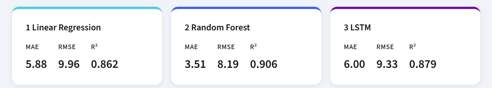
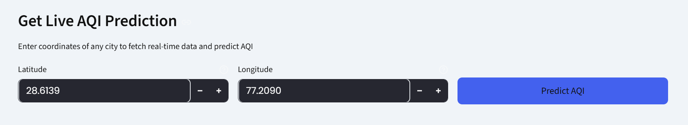
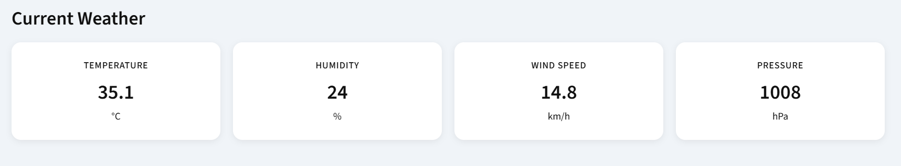
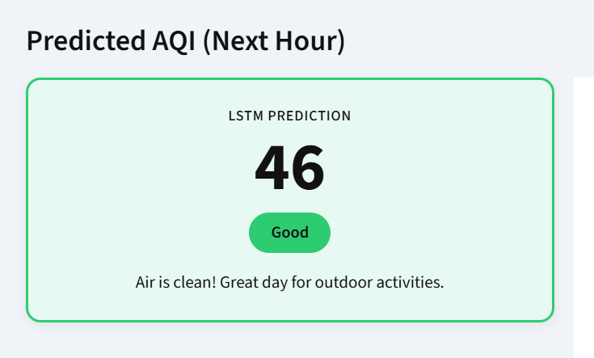
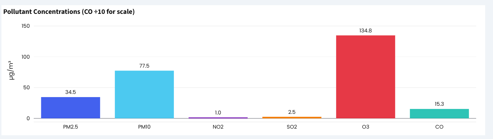
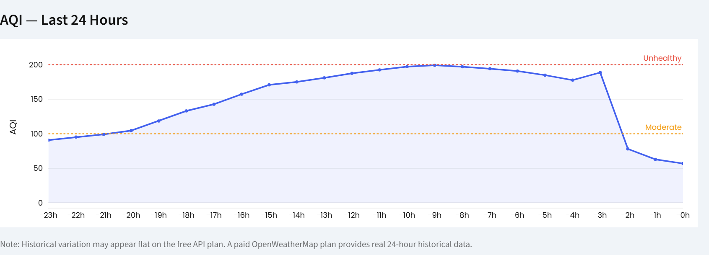
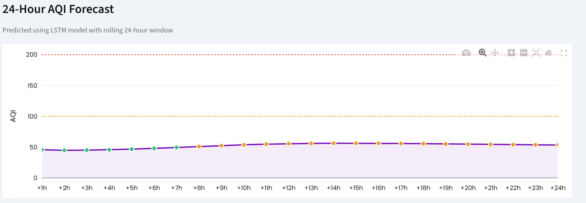
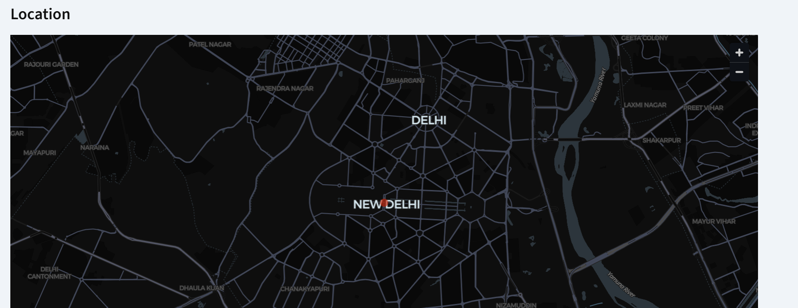
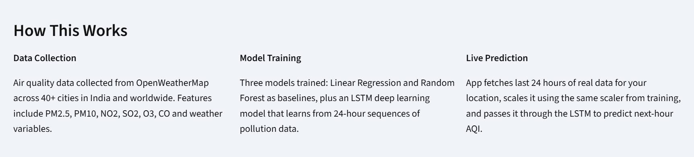

# AI Based AQI Forecasting System
A fully functional ML pipeline from raw api collection to deployed web app with three trained models, real-time prediction and a 24 hr rolling forecast.

Domain - Environmental AI / Air Quality
Data Source - OpenWeatherMap REST API
Models - LSTM , Random Forest, Linear Regression
Cities Covered - 40+ cities across India & few international cities

##  1. Problem Statement

This project addresses that gap by building a machine learning system capable of forecasting AQI for the next hour, and projecting trends up to 24 hours ahead, using real-time pollution sensor data 
and meteorological conditions.

## 2. Objectives 

1. Collect historical and real-time air quality data from multiple cities using an external API.
2. Engineer meaningful features from raw pollution readings and weather conditions.
3. Train and evaluate multiple machine learning models of increasing complexity.
4. Build a production quality web application for live AQI prediction.
5. Identify and fix data quality issues causing geographically implausible predictions.
6. Secure API credentials and deploy the application safely.

## 3. System Architecture

3.1 Pipeline
OpenWeatherMap API -> collect_training.py -> training_data.csv -> train.py -> models/ -> app.py -> Live Web App

3.2 File Structure
1. collect_training.py
2. train.py
3. app.py
4. training_data.csv
5. Models
  5.1 aqi_lstm_model.h5
  5.2 random_forest_model.pkl
  5.3 linear_model.pkl
  5.4 scaler.pkl
  5.5 model_metrics.pkl
  5.6 scaler_meta.pkl
6. .env
7. .streamlit/secrets.toml

3.3 API Endpoints Used

Endpoint - /weather
Used in -  collect_training.py, app.py
Purpose -  Current temperature, humidity, wind speed, pressure

3.4 how it works
OpenWeatherMap API
       │
       ▼
collect_training.py  ──►  training_data.csv
                                  │
                                  ▼
                            train.py  ──►  models/
                                               │
                                               ▼
                                           app.py  ──►  Live Web App

## 4. Data Collection

4.1 features collected 
pm2_5
pm10
no2
so2
o3
co
temp_c
humidity
windspeed_kph
pressure_mb
city
timestamp

4.2 error handling

The script wraps every API call in try/except blocks. If a city's data fetch fails due to network timeout, rate limiting, or invalid coordinates, that city is skipped with a warning message and collection continues for all remaining cities. A debug print outputs sample PM2.5 values per city so anomalous API responses can be caught immediately during collection

## 5. Model Training - train.py

5.1 Pipeline steps

Load training_data.csv and drop null values
Remove extreme outliers: pm2_5 > 200 and pm10 > 300
Apply per-city PM2.5 caps to fix geographically implausible spikes
Calculate AQI from capped pm2_5 using India's official breakpoint formula
Select 10 input features and 1 target column (aqi_index)
Scale all 11 columns to [0, 1] using MinMaxScaler
Create 24-hour sliding window sequences (X shape: samples x 24 x 11)
80/20 chronological train-test split
Train Linear Regression and Random Forest on flattened 2D sequences
Train LSTM on 3D time-series sequences
Evaluate all models; save models, scaler, and metrics to models/

5.2 
AQI is computed from PM2.5 using India's National Air Quality Index breakpoints. This same formula is used in both train.py and app.py it is the single source of truth for the entire project.

5.3 
A data quality fix applies city-specific PM2.5 upper limits before AQI calculation. This prevents API spike values from producing physically impossible AQI readings for clean cities like Shimla or London.

5.4 Models 
   5.4.1 Linera Regression (Baseline) - The 3D sequence data (samples x 24 x 11) is flattened to 2D (samples x 264) and fed into sklearn LinearRegression. This is the simplest possible baseline capturing only linear relationships between features and AQI with no temporal modeling.
   
   5.4.2 Random Forest (Baseline) - Same flattened 2D input. 30 decision trees with parallel fitting (n_jobs=-1). Captures non-linear relationships between pollution features but does not model temporal order explicitly.

   5.4.3 LSTM Deep Learning Model - The primary model. Takes 3D input (1, 24, 11). Architecture: LSTM(50, return_sequences=True) -> Dropout(0.2) -> LSTM(50) -> Dropout(0.2) -> Dense(1). Trained with Adam optimizer, MSE loss, 25 epochs, batch size 32.
   
5.5 A bug i fixed - All three models were using column index 0 for inverse_transform, but AQI is at column index 10 (the last column). This caused every prediction to be unscaled as if it were pm2_5, producing completely wrong AQI values. Fix: AQI_COL = 10. A shared inverse_aqi() helper ensures consistent column usage across all models.

6. Streamlit web app - aap.py

web application is built with Streamlit and provides an interactive dashboard for live AQI prediction. It loads pretrained models at startup, accepts user-provided coordinates, fetches live data from the OpenWeatherMap API, runs the LSTM prediction, and displays results with charts and health advice.

6.1 Application Sections

1. Model Performance - Cards showing MAE, RMSE, R2 for all 3 models + RMSE comparison bar chart

2. Live Prediction Input - Latitude/longitude number inputs + Predict button

3. Current Weather - 4 metric cards: temperature, humidity, wind speed, pressure

4. Predicted AQI - Large AQI number, color-coded category badge, health advice, gauge chart

5. Pollutant Breakdown - Bar chart of PM2.5/PM10/NO2/SO2/O3/CO + dominant pollutant insight

6. Last 24h Trend - Line chart of historical AQI from the API over the past 24 hours

7. 24h Forecast - Rolling LSTM forecast chart for next 24 hours + expandable data table

8. Location Map - Streamlit map component showing the queried coordinates

9. How This Works - 3-column explanation of data collection, training, and prediction

## 7. Built With

Python — Core language
TensorFlow / Keras — LSTM model
scikit-learn — Linear Regression, Random Forest, MinMaxScaler
Streamlit — Web application
Plotly — Interactive charts
OpenWeatherMap API — Real-time pollution and weather data
pandas — Data processing
python-dotenv — API key management

## 8. Known Limitations

Free API plan — The /air_pollution/history endpoint requires a paid OpenWeatherMap plan. On the free plan, the 24-hour historical chart will appear flat since only current data is available.
PM2.5-only AQI — The AQI formula currently uses PM2.5 only. India's official CPCB standard takes the maximum sub-index across all pollutants.
Dataset size — 30 days of data per city gives ~28,000 rows. More data would improve LSTM performance.
Autoregressive forecast — The 24-hour forecast feeds predictions back as input. Hours beyond +6 should be treated as trend direction rather than precise values.
